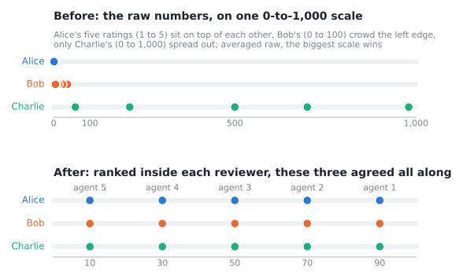
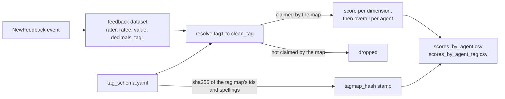

# agent-8004feedback: ERC-8004 reputation scoring

ERC-8004 puts agent feedback on-chain. This repo turns that feedback into per-agent reputation scores: **one deterministic, auditable
algorithm that adds no opinion of its own** (no prior, meaning no assumed starting score, and no operator-tunable constant in the scorer), plus the tag consolidation
that feeds it. Built as a **pip-installable library another repo imports**; the scoring logic is kept
strictly separate from all I/O.

An example of the gap this closes: three reviewers rating the same five agents, each on a scale of their own.

<p align="center">
  
</p>

Top: the fifteen raw numbers on one 0-to-1,000 scale. Alice's five (1 to 5) sit on top of each other, Bob's (0 to 100) crowd the left edge, and only Charlie's (0 to 1,000) spread out, so a raw average is decided by the biggest scale. Bottom: the same fifteen numbers ranked inside each reviewer. All three put the five agents in the same order. The worked example behind the picture is in [docs/GUIDE.md](docs/GUIDE.md).

## What's here
| Path | What | Role |
|---|---|---|
| `src/repscore/` | the scorer: `curve`, `score`, `identity`, the public front door | **pure library** (the packaged wheel) |
| `src/repscore/tagmap/` | the `tag1` → `clean_tag` resolver kernel (`normalize`, `schema`) | **pure library** (subpackage, read-only) |
| `scripts/run_score.py` | full-scale scoring run (feedback dataset in, score tables out) | I/O harness |
| `config/tag_schema.yaml.example` | an example tag map, `tag1` → `clean_tag` (a scoring input) | data |
| `tests/` | unit + weighting + determinism + a layering guard | tests |

**The seam:** `src/` performs no I/O on import, and bare `import repscore` pulls no third-party package
(`pyyaml`+`pydantic` load only with the resolver kernel, via `load_schema`); the only I/O in any call path is
`repscore.load_schema()` reading the map at the path it is given. `scripts/` imports
from `src/`; nothing in `src/` imports from `scripts/`. A `tests/test_layering.py` AST guard blocks a fixed list of I/O, network and
tooling imports from `src/`, so the boundary is hard to erode silently.

How the pieces connect (the feedback dataset is an input; this repo covers the resolve step onward):



## Quickstart
Python ≥ 3.11. The library needs `pyyaml`+`pydantic`; if your interpreter does not already have them,
`pip install pyyaml pydantic`. The harness runs straight from a checkout
without installing this package; `pip install -e ".[dev]"` adds the test and lint tools.

The tag map is a separate input to the scorer, so you choose which one to use. This repository bundles an example,
which is enough to run everything here; Reproducibility below covers the map behind a published score and using one
of your own.

**Score feedback:**
```bash
python scripts/run_score.py data/feedback_sample.csv --schema config/tag_schema.yaml.example --out data
```
`data/feedback_sample.csv` is the ten-agent sample dataset in this repository.
A feedback dataset is a CSV file with the columns `rater,ratee,value,decimals,tag1`, where `tag1` is the free-text label the reviewer attached to
the rating. Supply your own extract (spec: [docs/CONTRACT.md](docs/CONTRACT.md)).
Writes `data/scores_by_agent.csv` and `data/scores_by_agent_tag.csv`. Each row is keyed by `agent` (plus `clean_tag` in the by-tag file) and carries `band, score,
comparative_reviewers, non_comparative_reviewers, reviewer_differentiation, num_reviewers`, stamped with `repscore_version, tagmap_hash`.

**Run the tests:**
```bash
python -m pytest tests/ -q
```

## Use it from another repo
Install from a local checkout or straight from GitHub, then import. Full interface: [docs/CONTRACT.md](docs/CONTRACT.md).
```bash
pip install /path/to/deep3-agent-8004-feedback   # or: pip install "git+https://github.com/deep3labs/deep3-agent-8004-feedback.git"
```
```python
import repscore
resolver          = repscore.load_schema(".../tag_schema.yaml")         # any map; see Reproducibility
by_tag, by_agent  = repscore.resolve_and_score(raw_records, resolver)   # (rater,ratee,value,decimals,tag1)
```
The GitHub repository is `deep3-agent-8004-feedback`; the distribution you install is `agent-8004feedback` and the module you
import is `repscore` (`tagmap` is the internal `repscore.tagmap`). The three names differ by design. Front door:
`load_schema`, `resolve_and_score`, `resolve_records`, `schema_stamp`, `score`, `agent_key`,
`ERC8004_IDENTITY_REGISTRY`, `__version__`.

## The scorer (`repscore`)
An agent's number is a function of reviewers' data alone. Three operations: **normalize** (decode the
on-chain value), **relativize** (rank each reviewer's ratings onto 0–100), **aggregate** (weighted
means). Two self-derived weights, both the same statistic: **pairwise disagreement**, the fraction of
a set's pairs that differ. A reviewer is weighted by how often their *own* ratings differ (repetition
counts less; volume adds nothing), and a dimension (a concept reviewers rate on) is weighted by how distinctly its per-agent
scores separate agents (only whether the scores differ counts). Three outcomes, the first two named by the `band` column:
- **RANKED** (at least one comparative reviewer, meaning one whose ratings distinguished the agents they rated): a
  0–100 score, published with three reviewer counts and `reviewer_differentiation`, a rate on 0–100 that measures, on average, how varied
  each comparative reviewer's own ratings were. Those four fields describe the support behind the score; none of
  them is a probability that the score is correct. A score is published even when a single
  comparative reviewer stands behind it; a minimum-reviewer gate would be an injected opinion, so thin support is
  reported as it is, with its counts beside it.
- **INSUFFICIENT_COMPARATIVE_DATA**: no comparison expressed (rated alone, or all-equal marks); shown
  as a reviewer count, with **no score**.
- **Absent**: none of the agent's feedback was scoreable; no row at all.

There is **no sybil bound** on the score: nothing caps how much one actor using many wallets can move it (a cap would
require a prior, which injects an opinion);
`comparative_reviewers` beside `num_reviewers` *exposes* thin or lopsided support, and the consumer decides what is enough.
All arithmetic is exact (`fractions.Fraction`), so the same inputs always produce the same number, bit-for-bit.
Full methodology and accepted limitations: [docs/SCORING.md](docs/SCORING.md).

## Tag consolidation (the `repscore.tagmap` kernel)
The scorer ranks *within* a concept (`clean_tag`), and **only tags the map claims are scored**.
A tag map lists each dimension id with the raw `tag1` spellings that belong
to it (the id always resolves to itself, so a dimension needs no other members). The id is the `clean_tag` on every row.
Members match by normalized key: truncate to 64 chars, apply NFKC Unicode normalization (which folds variant
character forms such as full-width letters onto one spelling), casefold, and keep `[a-z0-9]`. So `trust_score`,
`trust-score` and `Trust Score` resolve identically.

A `tag1` the map does not claim is dropped: curation has either not placed it in a dimension yet or ruled it out for
good, and a map does not distinguish the two. So a new tag never reaches the scores half-curated.

Deep3 Labs produces its map with a curation module that runs in a private operations repository. In every new feedback
dataset the module finds each tag never seen before, holds it out of scoring, and proposes a placement: an exact or fuzzy match
against the map from the previous round where one exists, and for the rest a verdict from a language-model judge working to a fixed
rubric. A human decides each proposal: accept the suggestion, place the tag in a
different dimension, open a new dimension, reject the tag, or defer it. The module then applies
the decisions, validates the resulting map, recomputes its hash, and scores the full dataset in a dry run whose
results are inspected before anything is published. A curation round that changes the map produces a new map file
published at its own URL (see Reproducibility). The member spellings come from on-chain feedback text (they can name third-party
agents and products); this project neither wrote nor endorses any of it. Only the dimension ids are its own. [docs/SCORING.md](docs/SCORING.md) explains why this step is editorial and sits outside the no-opinion claim.

## Reproducibility
Every published number is reproducible from the same inputs; [docs/CONTRACT.md](docs/CONTRACT.md) lists them under
Reproducibility / provenance. The block height is not part of this library's input or
output. There is **no operator-tunable constant in the scorer** (the curation tooling has thresholds, but they only
shape the tag map). The only rounding is the final half-to-even to 2 decimals.

**The tag map is an input you choose.** Three situations:

*Running the code.* The bundled `config/tag_schema.yaml.example` is enough. It is a real tag map from a past curation
round and it produces real scores from the sample dataset. You do not need to check it against anything. It will not
reproduce a score published by someone else, and neither will the sample: `data/feedback_sample.csv` is a small
excerpt of real feedback, and every score is a position among the agents present in the extract you scored, so the
same agent scores differently from a fuller dataset even when the maps match.

*Scoring with a different tag map.* Any tag map file works, whether you wrote it or a publisher serves it. Run
`python scripts/run_score.py data/feedback_sample.csv --schema /path/to/map.yaml --out data`, or hand the path to
`repscore.load_schema()`. The path and the filename are yours to choose, and
`config/tag_schema.yaml.example` shows the format. The scorer works with whatever map it is given, and nothing in the
library privileges one publisher's.

*Getting the tag map behind a published score.* The publisher supplies it. A Deep3 Labs assessment is a JSON
document served per agent. It carries everything that identifies the inputs behind the score:

    method.repscore.tagmap.url      the exact tag map file used
    method.repscore.tagmap.sha256   sha256 of that file's bytes
    method.repscore.repository      the repository the commit below is in
    method.repscore.commit          the commit that produced the score
    method.repscore.version         the release of this scorer
    method.asOfBlock                the block each chain was read up to
    method.source                   where the records came from, and any exclusion applied

Fetch the assessment, then the tag map it names, and check the download:

    curl -s "<the assessment URL the publisher gave you>" -o assessment.json
    curl -fsSL -o tag_schema.yaml "$(jq -r .method.repscore.tagmap.url assessment.json)"
    sha256sum tag_schema.yaml       # must equal method.repscore.tagmap.sha256

That confirms you have the right tag map. Recomputing the number itself also needs the feedback records, read up to
the height for your chain in `method.asOfBlock`, scored with the code at `method.repscore.commit`. A score is a
position among peers, so it needs the feedback for every agent scored in each dimension the agent appears in. The
extraction spec is in [docs/CONTRACT.md](docs/CONTRACT.md).

`scripts/run_score.py` also writes a `tagmap_hash` column, and it is a different value. It covers the dimension ids
and the spellings listed under each; the published sha256 covers the file's bytes. Renaming the file, adding a
comment, or writing the dimensions in a different order leaves it unchanged. Two runs carrying the same
`tagmap_hash` used maps that resolve every tag identically. A difference does not prove the opposite, because the
order of the spellings is hashed and does not affect any score. It is a local stamp for comparing two of your own
runs. It is not published in an assessment and it does not locate anything.

## Docs
- [docs/GUIDE.md](docs/GUIDE.md): how to read a figure and how it is produced
- [docs/SCORING.md](docs/SCORING.md): the scoring algorithm, its limitations, and why the design is what it is
- [docs/CONTRACT.md](docs/CONTRACT.md): the cross-repo interface (imports, data shapes, provenance)

## License
MIT; see [LICENSE](LICENSE).
