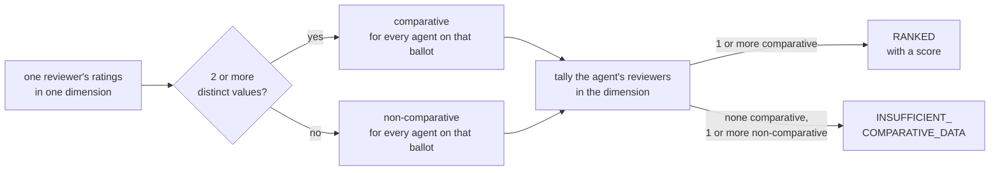
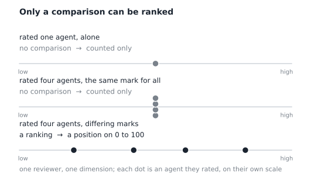
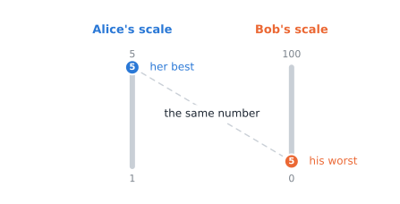

# ERC-8004 agent feedback, made comparable by Deep3 Labs

*ERC-8004 puts agent feedback on-chain, in a form that is hard to use directly. This is one open, reproducible way to make it comparable: the fields you receive, how to read them, and exactly how the figure is produced.*

## TL;DR

- **What it is.** One 0–100 figure per agent, and one per feedback *dimension*, built by **Deep3 Labs** from **ERC-8004** on-chain feedback. ERC-8004's on-chain reputation registry records that feedback, attributable to the submitting wallet, timestamped, and unaltered once written, though feedback can later be revoked. The registry guarantees only that the feedback was recorded as submitted; whether it is true or unbiased is left open.
- **A relative position.** 80 means "near the top of what these reviewers compared." Compare `RANKED` figures only to other `RANKED` figures.
- **Why it takes work.** Reviewers have rated on arbitrary, mutually incompatible scales (1–5, 0–100 and 0–1000 have all appeared) and have labeled their ratings inconsistently; the same "5" can mean best or worst. Making them combinable is the whole job.
- **Read the counts with the figure.** One reviewer, or a lopsided count, is a signal to weigh, and there is **no identity check**: nothing verifies that two reviewer wallets are two different people. Unanimous, undifferentiated praise yields no figure at all (`INSUFFICIENT_COMPARATIVE_DATA`).
- **One input among others.** It shows what the feedback says; on its own it is **not** a sufficient basis for trusting an agent. Every step is open, reproducible, and offered for others to check and improve.

## What you receive

For each agent: an **overall figure** (one 0–100 number), a **per-dimension breakdown** (the same kind of figure, one for each curated concept the agent received feedback in: a "trust" concept, a "reliability" concept, and so on; these concepts are the **dimensions**), and **three counts and a rate** describing the support beneath each figure. Every field below except `clean_tag` is available **per agent** and **per (agent × dimension)**.

| Field | Meaning |
|---|---|
| `band` | One of two values; it determines whether a figure exists. No scoreable feedback means no row. |
| `score` | The 0–100 figure. Present **only** when `band` is `RANKED`. |
| `comparative_reviewers` | Count of distinct reviewers who rated this agent against others *and* gave differing ratings; the ones whose comparisons set the figure. |
| `non_comparative_reviewers` | Count of distinct reviewers who expressed no comparison (rated it alone, or gave everything the same mark); on the overall row, only those who did so in every dimension they rated it in. A reviewer who compared it anywhere counts once, as comparative, so the two counts add up to `num_reviewers`. Because of this a per-dimension row's count can exceed the overall row's. |
| `reviewer_differentiation` | 0–100 rate, present only when `band` is `RANKED`: on average, how much each comparative reviewer varied their own ratings; higher means more variation. |
| `num_reviewers` | Total distinct reviewers who left feedback on this agent in curated dimensions. |
| `clean_tag` | Per-dimension rows only: the dimension's id, the concept the row is about. |

| Outcome | When it applies |
|---|---|
| `RANKED` | At least one reviewer rated it against others *and* differently; a 0–100 `score` exists. |
| `INSUFFICIENT_COMPARATIVE_DATA` | Only feedback that expressed no comparison (rated alone, or all-equal marks). Nothing to rank against, so you get the counts and no `score`. |
| *(no row)* | None of its feedback was scoreable; the agent isn't shown at all. |

Two decisions produce those outcomes. The first asks, for one reviewer in one dimension, whether that reviewer expressed a comparison at all, judged over every agent they rated there (their ballot). The second asks, for one agent, whether any of its reviewers in that dimension was comparative. The overall row makes the second decision the same way over all of the agent's dimensions at once, a reviewer counting as comparative if they compared the agent in any of them.

**These are counts and a rate. None of them is a "confidence" or a probability that the figure is "right."** In particular `reviewer_differentiation` describes how often the reviewers' own ratings differ; it says nothing about their trustworthiness. A reviewer who varied ratings at random would score high on it too.

An example of the difference between feedback that can be ranked and feedback that can only be counted:

  

A reviewer who rated one agent alone, or gave everyone the same mark, expressed no comparison; that feedback is counted. A reviewer who rated several agents differently produced a ranking, which becomes a position on 0 to 100.

## How to read a figure

- **Relative.** 80 is "near the top of what these reviewers compared." The figure is a position among peers and carries no absolute meaning.
- **Weigh the support.** Read `comparative_reviewers` with `num_reviewers`, and glance at `reviewer_differentiation`. A 90 from one reviewer is far thinner than a 90 from twenty who clearly differentiate.
- **One reviewer can place an agent anywhere in their ballot's range.** The figure faithfully reflects that ballot, and it rests on a single opinion; `comparative_reviewers` reads `1` to say so.
- **A lopsided count is a signal.** A large `num_reviewers` beside a tiny `comparative_reviewers` is one shape crude review-padding can take. There is **no identity check**, so a determined actor submitting genuine, differing ratings is weighted like anyone else.
- **Comparable only within a shared peer set.** Two agents can both read 75 and mean different things: one ranked against three weak peers, the other against fifty strong ones. Compare across very different peer sets with care.
- **Unanimous praise → no figure.** All-alone or all-equal feedback shows `INSUFFICIENT_COMPARATIVE_DATA`: a count only.

## How the figure is produced

Every step stays strictly inside what reviewers expressed.

**Why not just average the raw numbers?** Because reviewers use different scales. Suppose **Alice**, **Bob**, and **Charlie** rate the same five agents, and we naively average each agent's three raw numbers:

| Agent | Alice (1–5) | Bob (0–100, harsh) | Charlie (0–1000, generous) | Naive average |
|---|---|---|---|---|
| 1 | **5** | 38 | 980 | **341** |
| 2 | 4 | 25 | 700 | 243 |
| 3 | 3 | 14 | 500 | 172 |
| 4 | 2 | 8 | 210 | 73 |
| 5 | 1 | **5** | 60 | **22** |

Two problems. Alice's **5** is her *best*; Bob's **5** is his *worst*, and averaging treats them as equal. And the naive average is essentially Charlie's 0–1000 column divided by three: **the biggest scale silently wins.**

The first problem as a picture:

  

The same number means opposite things on two scales, so raw numbers cannot be averaged. Ranking keeps only where each reviewer placed an agent.

**The fix: keep only each reviewer's ranking, spread evenly onto one 0–100 scale.** Each reviewer above used five distinct ratings, so each maps to 10 / 30 / 50 / 70 / 90:

| Agent | Alice → | Bob → | Charlie → | Combined |
|---|---|---|---|---|
| 1 | 90 | 90 | 90 | **90** |
| 2 | 70 | 70 | 70 | 70 |
| 3 | 50 | 50 | 50 | 50 |
| 4 | 30 | 30 | 30 | 30 |
| 5 | 10 | 10 | 10 | **10** |

All three ranked the agents the same way all along; it was not visible until they were on one rank scale.

Both tables as one picture:

  

Top: the fifteen raw numbers on one 0-to-1,000 scale. Alice's five (1 to 5) sit on top of each other, Bob's (0 to 100) crowd the left edge, and only Charlie's (0 to 1,000) spread out, so a raw average is decided by the biggest scale. Bottom: the same fifteen numbers ranked inside each reviewer.

### Step 1: Group every spelling of a concept into one curated dimension

Reviewers label each rating with free text; "trust" alone has appeared as `trust`, `trust_score`, `Trust Scores`, `agent_trust_score`, `trust-oracle`. Curation proposes groupings (exact matches once case and punctuation are ignored, then fuzzy spelling matches, then a language-model judge for whatever is left); a person decides every one, so like-for-like feedback is grouped before anything is computed. This is the one genuine editorial judgment in the method, and the resulting groupings are published in full so they can be audited, because every downstream number depends on them. That published file is what the code and the technical docs call the **tag map**. A tag that is not placed in a dimension is held out entirely, whether curation has yet to decide it or has ruled it out; the published groupings do not distinguish the two.

### Step 2: Replace each reviewer's raw numbers with their ranking, on 0–100

Within one reviewer and dimension, first decode each on-chain value as `value / 10^decimals` and average any repeat ratings of the same agent into one, then sort their agents worst-to-best and place them evenly: top toward 100, bottom toward 0. Ranks ignore the actual numbers, so this erases how lenient or harsh a reviewer is and keeps only *where they placed each agent*. A rating at average rank $r$ among $n$ ratings (ties share their average rank) maps to:

$$\text{position} = 100 \times \frac{r - \tfrac{1}{2}}{n}$$

So five distinct ratings → 10, 30, 50, 70, 90; three → 16.7, 50, 83.3. A lone rating would map to 50, but a ballot with one agent is never ranked (Step 3). A reviewer who rated 50, 51 and 52 spreads them exactly as widely as one who rated 5, 50 and 95.

With a tie, four ratings $\{3, 4, 5, 5\}$, so $n = 4$ and the two 5s share rank $(3 + 4)/2 = 3.5$:

| Rating | Average rank $r$ | Position $100 \times (r - \tfrac{1}{2}) / 4$ |
|---|---|---|
| 3 | 1 | 12.5 |
| 4 | 2 | 37.5 |
| 5 | 3.5 | 75 |
| 5 | 3.5 | 75 |

The tied agents land on the same position, and the ballot's differentiation (Step 3) is $1 - 2/12 = 0.83$: of the six pairs of ratings on this ballot, one pair repeats a value.

### Step 3: Weight each reviewer by how much their own ratings vary *(reviewer-level weight)*

A **weight** is how much a reviewer's opinion counts in the average that follows: weight 0 moves the figure not at all, larger weights pull it more. Weights are never negative, and are set entirely **by the data**.

A reviewer's weight is their **differentiation** $d$: how distinctly they rank agents. For a ballot of $n$ ratings in which $c_v$ of them equal the value $v$:

$$d \;=\; 1 - \frac{\sum_v c_v(c_v-1)}{n(n-1)} \;=\; \frac{n}{n-1}\Big(1 - \sum_v p_v^2\Big), \qquad p_v = \frac{c_v}{n}$$

$d$ is the fraction of the reviewer's rating-*pairs* that differ: $d = 1$ when all ratings are distinct, $d \to 0$ when nearly all identical. For example $\{5,3\} \to 1$, $\{5,5,4,3\} \to 0.83$, $\{4,4,4,4\} \to 0$. *(Statisticians' names: the without-replacement Gini–Simpson index, also called Hurlbert's probability of interspecific encounter; see Methods.)*

The reported `reviewer_differentiation` summarizes the $m$ comparative reviewers behind a figure as a plain average, rescaled to 0–100:

$$\frac{100}{m}\sum_{i=1}^{m} d_i$$

Each reviewer contributes exactly one $d_i$, so breadth never counts twice. On a **per-dimension** figure that is their $d$ in that dimension. On the **overall** figure a reviewer may have rated the agent in several dimensions; their $d_i$ is then the plain average of their per-dimension $d$ values over the dimensions of this agent they rated comparatively. Pooling those dimensions into one differentiation would read a rating repeated in a second dimension as a repetition, lowering the reported rate for a reviewer who rated in more than one dimension.

A reviewer who gives every agent the same mark has $d = 0$ and moves nothing: zero variation carries zero information, so the weight is zero by arithmetic. For a reviewer who rated a single agent the formula is undefined ($0/0$), and they are treated the same way. Both still count in `num_reviewers`, and in `non_comparative_reviewers` for that dimension, but neither touches that dimension's `score`. On the overall row a reviewer counts as non-comparative only when they compared the agent in **none** of its dimensions.

### Step 4: Combine a dimension's reviewers into one figure, adding nothing

Blend the reviewers' 0–100 positions with a weighted average, using the Step 3 weights. **Nothing else enters**: no baseline, no default 50, no floor, no minimum-reviewer bar:

$$\text{figure} = \frac{\sum_i w_i\,x_i}{\sum_i w_i}, \qquad x_i = \text{position (Step 2)}, \quad w_i = d_i \ \text{(Step 3)}$$

Because every $w_i \ge 0$ and at least one is positive, the figure lies between the smallest and largest position. If $\sum_i w_i = 0$ (every reviewer non-comparative), no figure is emitted and the band is `INSUFFICIENT_COMPARATIVE_DATA`.

### Step 5: Roll the dimensions into one overall figure *(dimension-level weight)*

A second weighting, over dimensions. Each dimension $k$ gets a weight $W_k$ from the **same** differentiation formula, applied to that dimension's per-agent figures (each agent's figure treated as one "rating," $N$ agents):

$$W_k = 1 - \frac{\sum_v c_v(c_v-1)}{N(N-1)}, \qquad \text{overall} = \frac{\sum_k W_k\,f_k}{\sum_k W_k}, \qquad f_k = \text{the agent's figure in dimension } k$$

If every $W_k = 0$, the overall is the plain average of the per-dimension figures.

This responds to **distinctness** (judged on the exact values, before rounding): when per-agent figures are all distinct, every $W_k = 1$ and the overall is a plain average, so $\{49, 50, 51\}$ and $\{5, 50, 95\}$ weigh the same. The weight discounts a dimension as its agents' figures repeat, reaching zero when every agent lands on the same figure. How important each dimension is remains your call, which is why the **per-dimension figures are always there for you to weigh yourself**.

## What's solid, and what's open

The dependability is in the construction, which is why every step is written out above:

- **Only ERC-8004 feedback goes in.** No outside data, no default value, no minimum-reviewer gate, no by-hand judgment about specific agents. The number moves only when the feedback moves or the groupings it was computed with change.
- **Every step is a standard, decades-old operation**: rank/percentile normalization and a textbook diversity index (see Methods). The one judgment call, grouping labels into concepts, is done openly.
- **Exact and reproducible.** Anyone with the same inputs recomputes the same figure; the [repository README](https://github.com/deep3labs/deep3-agent-8004-feedback#reproducibility) explains how to get them.
- **No outside validation.** The method is not externally certified or independently validated, and it does not claim to detect deception.

**And it's open on purpose.** The feedback is public, so this is a demonstration that a little transparent work makes that raw feedback far more usable, while making its limits (no identity check, thin support, the subjectivity of label curation) just as visible. Deep3 Labs built this first version and is putting the groupings, the formulas and the method in the open, to be reproduced, challenged, and improved. Feedback and better ideas are welcome through the repository's [issue tracker](https://github.com/deep3labs/deep3-agent-8004-feedback/issues).

## Methods & references

The established method behind each step.

**Rank-to-100 scaling (Step 2).** Within each reviewer and concept, raw ratings are replaced by their **percentile rank** (an item's position among the peers it is compared against), a standard, long-established normalization in statistics and educational measurement (the percentile/centile lineage traces to Galton in the 1880s). The exact convention is the **Hazen plotting position**, $(r - \tfrac12)/n$, which spreads $n$ ratings evenly across the scale (for $n=5$: 10, 30, 50, 70, 90) and places a lone rating at the 50th percentile (Hazen, 1914).

**Removing reviewer leniency (Step 2, rationale).** Because ranks are invariant to any strictly increasing rescaling of the numbers, working in ranks strips out each reviewer's own scale, including how lenient or harsh they happen to be. (Replacing values with ranks is the **rank transformation**; Conover & Iman, 1981. That paper is about hypothesis testing; the invariance property it relies on is what does the work here.) That reviewers differ systematically in leniency, and that comparable measures should adjust for it before combining raw numbers, is well established in psychometrics: **Many-Facet Rasch Measurement** (Linacre, 1989) models rater severity as an explicit facet. Ours is a lighter-weight rank normalization and, unlike Rasch, does **not** estimate a shared severity scale across reviewers who rated non-overlapping agents. The broader "score, then rank" idea is standard in grant review, where the US National Institutes of Health has converted scores to percentile ranks so applications stay comparable across panels that score differently.

**Variation weighting (Steps 3 and 5; `reviewer_differentiation`).** Each reviewer's weight is a pairwise-disagreement statistic: the probability that two of their ratings, chosen at random, differ. Drawing those two ratings with replacement instead gives the **Gini–Simpson index**, $1 - \sum_i p_i^2$ (Simpson, 1949): 0 when all ratings are identical, rising toward 1 as they diverge. The identical quantity is the **Gini impurity** used to choose splits in CART decision trees (Breiman et al., 1984), so the same statistic underpins both ecological diversity and mainstream machine learning. Deep3 Labs uses the without-replacement (pairwise) form, $\tfrac{n}{n-1}(1 - \sum_i p_i^2)$ (equivalently, the fraction of rating-pairs drawn without replacement that differ); this is **Hurlbert's probability of interspecific encounter** (Hurlbert, 1971; earliest lineage Gini, 1912). It reaches 1 only when every rating is distinct, whereas the with-replacement form caps a ballot of two differing ratings at 0.5; that is why a reviewer who made even two genuinely different ratings is fully credited for the comparison they expressed.

**Down-weighting inputs that do not vary (rationale).** An input that never varies carries no information to weight. This is the same principle by which a degenerate (single-valued) distribution has zero entropy (Shannon, 1948), and by which near-zero-variance predictors are routinely discounted in applied modeling (Kuhn & Johnson, 2013). A reviewer who gives every agent the same mark, or a dimension on which every agent looks identical, contributes nothing.

**Combining.** Per dimension, an agent's figure is the reviewer-weighted average of its positions across comparative reviewers; the overall figure is the dimension-weighted average of its per-dimension figures. Both are plain weighted averages of values reviewers expressed (nothing else added), so every figure stays within the range of the underlying feedback.

### References

- Galton, F. (1885). "Anthropometric percentiles," *Nature* 31:223–225. Percentile/centile normalization.
- Hazen, A. (1914). Plotting position $(i - \tfrac12)/n$, *Transactions ASCE* 77. Frequency analysis.
- Conover, W.J. & Iman, R.L. (1981). "Rank Transformations as a Bridge Between Parametric and Nonparametric Statistics." *The American Statistician* 35(3):124–129. Origin of the term "rank transformation."
- Linacre, J.M. (1989). *Many-Facet Rasch Measurement.* Chicago: MESA Press. Rater severity as an explicit facet (a heavier method than ours; noted for contrast).
- NIH percentile ranking of peer-review scores. Rank normalization across differing reviewers, in practice.
- Simpson, E.H. (1949). "Measurement of Diversity." *Nature* 163:688. The concentration $\sum_i p_i^2$; its complement is the Gini–Simpson index.
- Gini, C. (1912). *Variabilità e Mutabilità*. Earliest lineage of $1 - \sum_i p_i^2$.
- Breiman, L., Friedman, J., Olshen, R. & Stone, C. (1984). *Classification and Regression Trees*. Gini impurity, $1 - \sum_i p_i^2$, the same statistic.
- Hurlbert, S.H. (1971). "The nonconcept of species diversity." *Ecology* 52:577–586. Probability of interspecific encounter, the without-replacement form.
- Shannon, C.E. (1948). "A Mathematical Theory of Communication." A constant distribution has zero entropy.
- Kuhn, M. & Johnson, K. (2013). *Applied Predictive Modeling*. Near-zero-variance predictor removal.
